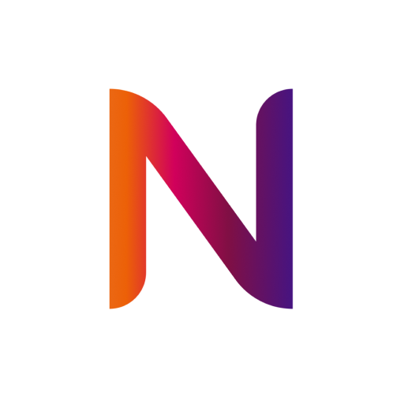

# NeoQuest



## 📝 Описание

**NeoQuest** — это мобильное приложение, которое предствляет собой квиз с историями о компании Neoflex. Здесь присутствует магазин и достижения, а также страница с заказами и корзина, ну и конечно же приветливый onboarding!

## 📌 Итоги разработки

В процессе работы над проектом были освоены следующие аспекты разработки на Flutter:

- С полного 0 освоены основы программирования на **dart** и разработка **Flutter-приложений**.
- Познаны глубины работы с локальной **SQLite** базой данных.
- Многократко углублены знания в области оптимизации приложений.
- Более глубоко изучены аспекты хорошего дизайна.
- Изучены **Provider** и **Shimmer**

Несмотря на все достижения, в проекте не были реализованы некоторые функции, такие как:

- Реализация базы данных посредством **Firebase**, так как не было времени и необходимых знаний.
- Многие аспекты оптимизации устройств не были доведены до идеала.
- Не изучен **Bloc** и **Riverpod**

Тем не менее, проект полностью работоспособный и уже является хорошим результатом, на мой скромный счет, для первого проекта без обучения данным технологиям. Все было сделано чисто на усилиях команды.

## 📦 Скачать APK

[Скачать релизный APK](release/app-release.apk)

## 🚀 Запуск проекта

1. Клонируйте репозиторий:
   ```bash
   git clone https://github.com/твое_имя/NeoQuest.git
2. Перейдите в каталог:
   ```bash
   cd NeoQuest
3. Установите зависимости:
   ```bash
   flutter pub get
4. Запустите проект:
   ```bash
   flutter run

**Важно**: Для запуска на **iOS** необходимо установить *Xcode*, а для **Android** — *Android Studio* с настроенным эмулятором или подключённым устройством.

## 🛠 Использованные технологии

- Flutter: для создания кроссплатформенного мобильного приложения.
- Provider: для управления состоянием.
- Shimmer: для создания эффектов загрузки.
- SQLite: для хранения и управления статистики, диалогов, вопросов и прочего.

## 📬 Контакты

**Email**: *programming.creature@email.com*

**GitHub**: *https://github.com/TheGreatLibrary*
